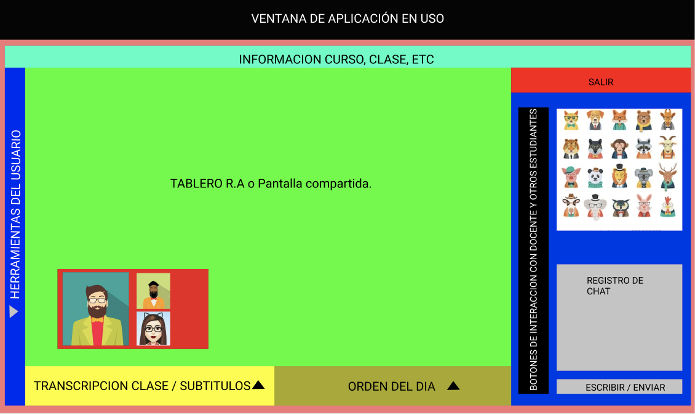
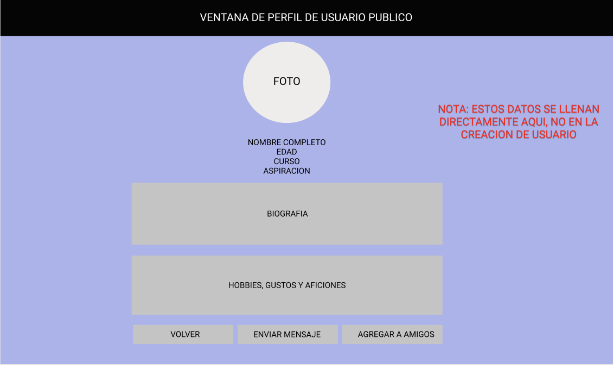
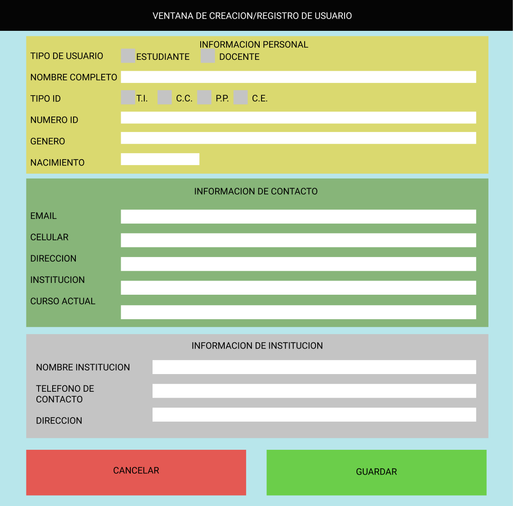
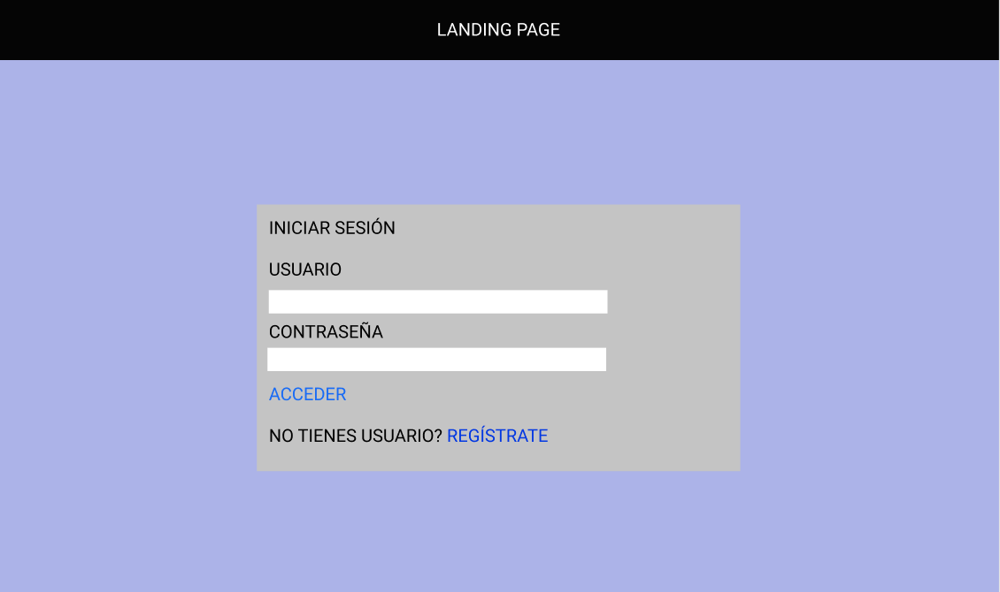

# Vedar
Proyecto Hackathon Uniandes 2020 del equipo Alpha Doradus.

## Integrantes del equipo

 - Daniel Camacho
 - Juan Pablo Ramirez
 - Juan Pablo Galvis
 - Juan Alegría
 - Luis Felipe Ariza

## Visión general

Vedar es una plataforma de videollamadas interactiva, amigable, y eficaz especializada en el sector educativo. Esta plataforma permite cerrar las brechas entre la virtualidad y la presencialidad de las clases al proveer alternativas que usan la realidad aumentada y la detección de gestos como principal medio de interacción.

## Objetivos

- Proveer un avatar para cada estudiante, sin mostrar el entorno propio de cada uno para respetar la privacidad de los usuarios.
- Permite obtener un tablero virtual utilizando detección de gestos y su representación, en tiempo real, con objetos y modelos 3D de realidad aumentada.
- Generar retroalimentación en tiempo real e inmediatamente, luego de la clase, producir resultados tanto para los docentes como para los estudiantes.
- Generar datos, estadísticas y gráficas sobre la atención de los estudiantes para los docentes, al tener inteligencia artificial previamente entrenada para detectar caras de confusión.
- Permite conocer los estudiantes que no se encuentran frente a la cámara al mostrar un avatar con apariencia de sueño.
- Generar resumen y transcripción de la clase para los estudiantes.
- Generar un ambiente de clase y compañerismo al tener avatares en todo momento.
- Brindar mayor expresividad remota.
- Ofrecer una sensación de cercanía.

## Tech Stack
Para el desarrollo de Vedar se hará un posible uso de las siguientes tecnologías: 
- OpenCV
- Python

## Prototipo de la plataforma

### Pantalla de clase

### Perfil de usuario

### Registro de usuario

### Landing page

